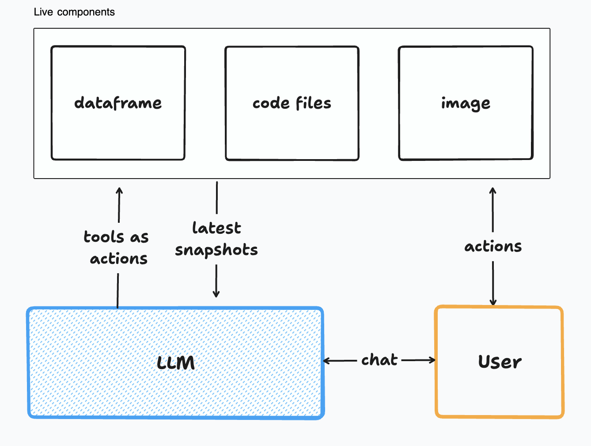

<div align="center"><picture>
  <source media="(prefers-color-scheme: dark)" srcset="docs/figures/logo_dark.svg">
  
</picture></div>
<br/>


**`aiide`** is a LLM datastructure management library for providing a RL-type environment to the LLM. It allows you to declare live components(ENV), enable the LLM through tools to modify the ENV and provide the LLM with reward(as function response) and latest snapshot of the ENV.

<div align="center"><picture>
  <source media="(prefers-color-scheme: dark)" srcset="docs/figures/aiide_overview.png">
  
</picture></div>
<br/>

### Tutorial
Let's build a simple form filling agent. We have a pandas dataframe with field names and we want the LLM to ask the user for answers to a couple of questions at a time and populate the said dataframe.

Here
* The environment is the dataframe
* We need a single tool that enables the LLM to add or edit values for any of the fields
* _The library will automatically provide the latest snapshot of the dataframe to the LLM.(aiide will automatically remove older snapshots of the dataframe from the LLM memory to avoid confusing it and saving tokens)_

1. Let's start with defining a simple chat agent

```python
# Import the AIIDE class
from aiide import AIIDE
# Import helper classes for defining functions for the LLM
from aiide.tools import TOOL_DEF, INT, FLOAT, STR, BOOL, LIST, DICT

import pandas as pd
# Define a class and inherit the AIIDE class
class FormFillingAgent(AIIDE):
    def __init__(self):
        # Let's define a dummy dataframe with fields and value as the columns
        self.df = pd.DataFrame({
            "Field":["name","age","gender","email","city","job","married"],
            "Value":["Not yet assigned" for i in range(7)]
        })

        # Here we only have one component and providing it as the element for the reserved ENV array
        self.ENV =[self.df.to_markdown(index=False)]

        # use setup to define the system message, type of model, temperature etc
        self.setup(messages=[{"role":"system","content":"You are a helpful assistant. Fill the form table attached by asking the user to answer a couple of fields from the table at a time."}],model="gpt-3.5-turbo",temperature=0.2)
```
> Set your openai key as `OPENAI_API_KEY` enviroment variable or pass it in setup as api_key

2. Let's define the tool. We have to define the tool as a class inside our `FormFillingAgent` class
```python
class FormFillingAgent(AIIDE):
    def __init__(self):
        ...
    class Tool:
        def __init__(self):
            # we can access the FormFillingAgent instance through .parent
            self.parent.df

            # We now have to define the function definition and assign it to the reserved self.tool_def variable
            self.tool_def = TOOL_DEF(
                name = "add_or_modify_form_values",
                description = "tool to add or modify field values",
                properties = [
                    STR(
                        name = "field_name",
                        enums=self.parent.df["Field"].values.tolist()
                        ),
                    STR(
                        name = "value"
                    )
                ]
            )
        
        # Main function of the tool is called when the tool is invoked by the agent
        def main(self, field_name,value):
            # let's set the value in the master dataframe
            self.parent.df.loc[self.parent.df['Field'] == field_name, 'Value'] = value
            # response to the agent
            return "Added value '"+str(value) + " to Field '"+field_name+"'"

```

3. That's it. We can now start using the agent

`chat` is the function you invoke to start streaming agent response
```python
# create the agent instance
agent = FormFillingAgent()
while True:
    # get the user message
    user_query = input("User: ")
    # you can enable and disable tools as you wish with the tools array
    for each in agent.chat(user_query, tools=["add_or_modify_form_values"]):
        # if the agent is reponding in text
        if each["type"] == "text":
            print(each["delta"],end="")
        # is the agent is calling a tool
        if each["type"] == "tool":
            print("TOOL CALL:",each["tool_name"],each["tool_arguments"])
        # the tool's response to the agent
        if each["type"] == "tool_response":
            print("TOOL RESPONSE",each["tool_response"])
    # for debugging, let's print the table after every turn
    print(agent.df)
```

4. What if you want to take user's consent everytime before filling the table?
it's incredibly simple!

You simply add a consent bool variable in the Tool class and update it in the chat loop as needed.

Here is the updated code:
```python
# edit the tool to reject is the user rejects
class FormFillingAgent(AIIDE):
    def __init__(self):
        ... previous code
    class Tool:
        def __init__(self):
            # User consent bool 
            self.user_consent = False

            ... previous code

        def main(self, field_name,value):
            if self.user_consent == False:
                return "User has rejected the insert, please try again"

            # let's set the value in the master dataframe
            self.parent.df.loc[self.parent.df['Field'] == field_name, 'Value'] = value
            # response to the agent
            return "Added value '"+str(value) + " to Field '"+field_name+"'"

agent = FormFillingAgent()
while True:
    user_query = input("User: ")
    for each in agent.chat(user_query, tools=["add_or_modify_form_values"]):
        if each["type"] == "text":
            print(each["delta"],end="")
        if each["type"] == "tool":
            print("TOOL CALL:",each["tool_name"],each["tool_arguments"])
            # ask for user consent
            user_consent = input("do you approve the above tool call?(y/n)")
            if user_consent == 'y:
                # you can access the tool instance like so
                agent.Tool.user_consent = True
            else:
                agent.Tool.user_consent = False
        if each["type"] == "tool_response":
            print("TOOL RESPONSE",each["tool_response"])

```

5. Bonus!
You can use completions and stop sequences in the `chat` function's arguments to implement prompting techniques such as ReAct, CoT etc!


