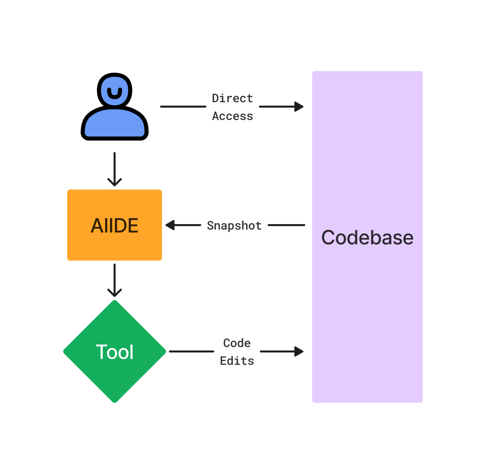
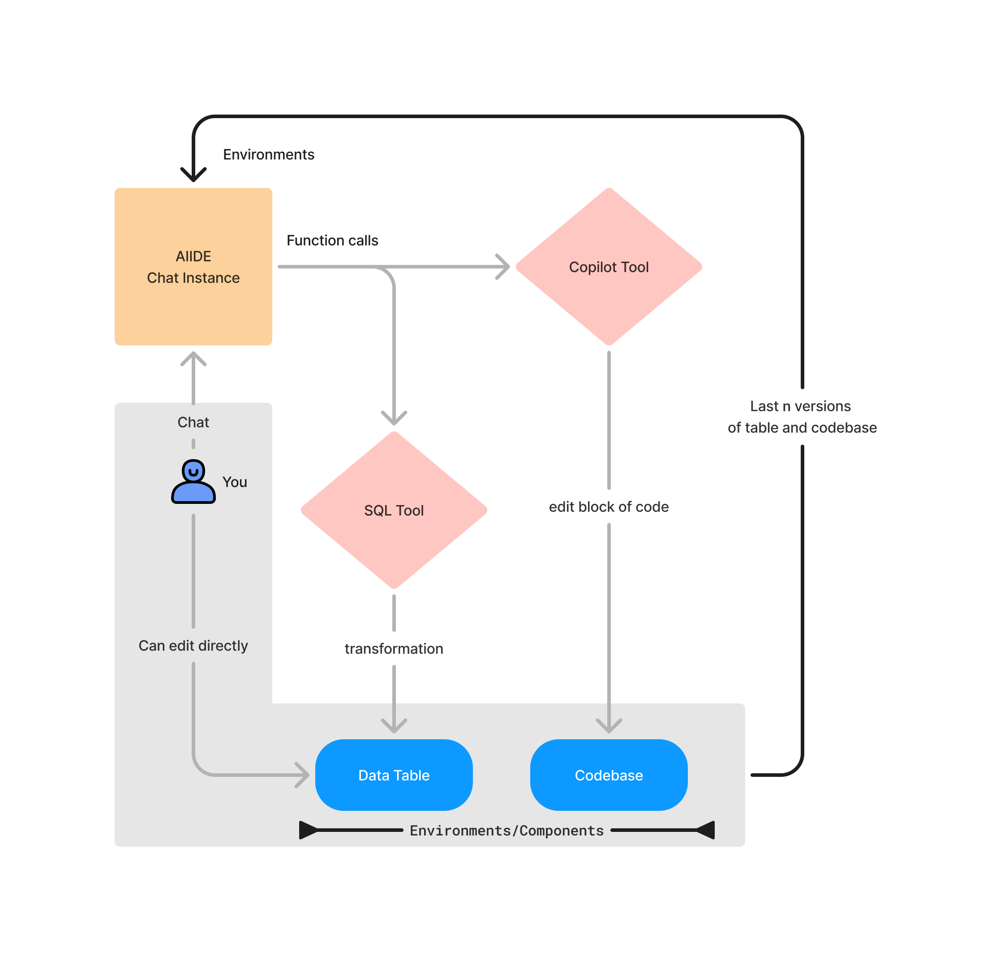

# What is this?

* LLMs by themselves can only provide you with the information they have been trained on

* LLMs with Tools can fetch information, perform computations, and more on fixed piece of information/data

* LLMs with Environments can work alongside you in sync, fetching latest information and performing actions. Ex: Copilot of Code, Calender, Image editing etc.

# How does it work?
<CardGrid>
<Card title="Simple view" >
		{/* > Pandas agent is now the defacto tool for any computational analysis but it's not modular. */}

	</Card>
	<Card title="Advanced workflow" >
		{/* > Pandas agent is now the defacto tool for any computational analysis but it's not modular. */}

	</Card>
</CardGrid>

import { Card, CardGrid,Code } from '@astrojs/starlight/components';

{/* <Code code="pip3 install aiide" lang="bash" title="Install" mark={['aiide']} /> */}
## Features
<CardGrid>
	<Card title="Tools are first class citizens" icon="seti:html">
		Tools are defined as classes to enable defining complex logic with memory.
		{/* > Pandas agent is now the defacto tool for any computational analysis but it's not modular. */}
	</Card>
	<Card title="Tools act on Environments" icon="laptop">
		Inspired from Reinforcement Learning, provide snapshots of Environments to the LLM to work on.
		{/* > Environments could be `code files`, `data tables`, `images`  etc. */}
	</Card>
	<Card title="Reactive framework" icon="puzzle">
		Bi-directional access between the tools and the chat instance.
	</Card>
	<Card title="Streaming made intuitive" icon="rocket">
		Simple but powerful streaming API to build great user experiences.
	</Card>
</CardGrid>
